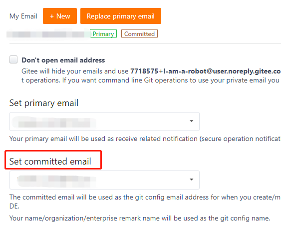

## 设置本地开发环境
```sh
    git config user.email = example@xx.com
```

**Note**: 这里的邮箱必须是贡献者注册到Gitee种的邮箱地址，见下图所示



## 常见的问题

### 机器人提示未签署CLA，去签署又提示已签署

  机器人是通过检查PullRequest中所有commit的作者是否签署了CLA来判定PR是否完成了CLA签署。

  此种情况请按如下步骤检查。

  1. 在开发环境中运行 *git log* ，查看PR涉及的每个commit的作者的邮箱

```sh
$ git log

commit 6c5e70b984a60b3cecd395edd5b48a7575bf58e0
Author: Jessica Smith <jessica@example.com>
Date:   Sun Apr 6 10:17:23 2008 -0700

   add limit to log function

   Limit log functionality to the first 20

```

  2. 查看Gitee账号中的邮箱


  3. 比较这2个邮箱是否一致，如果一致，请提issue；否则请选择如下任意一种方式处理

     *方法1*：

       运行如下命令进入交互式界面
```sh
    git rebase -i HEAD~n # n 是需要修改的commit的编号，最新提交的commit的编号是1，以此类推
```

       在交互式界面中选择需要修改的commit，将pick 改为 edit，之后退出交互式界面

       运行如下命令，替换--author的参数，修改commit的作者
```sh
    git commit --amend --author="Author Name <email@address.com>" --no-edit
    git rebase --continue
```

     *方法2*：
       更新Gitee 账号中提交邮箱为commit作者的邮箱，并重新签署
